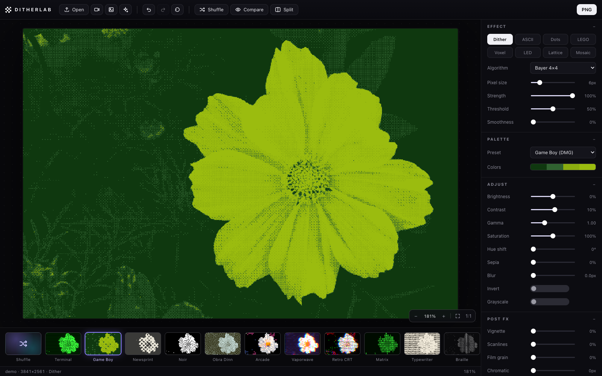
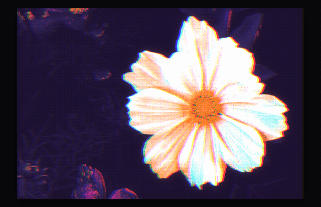
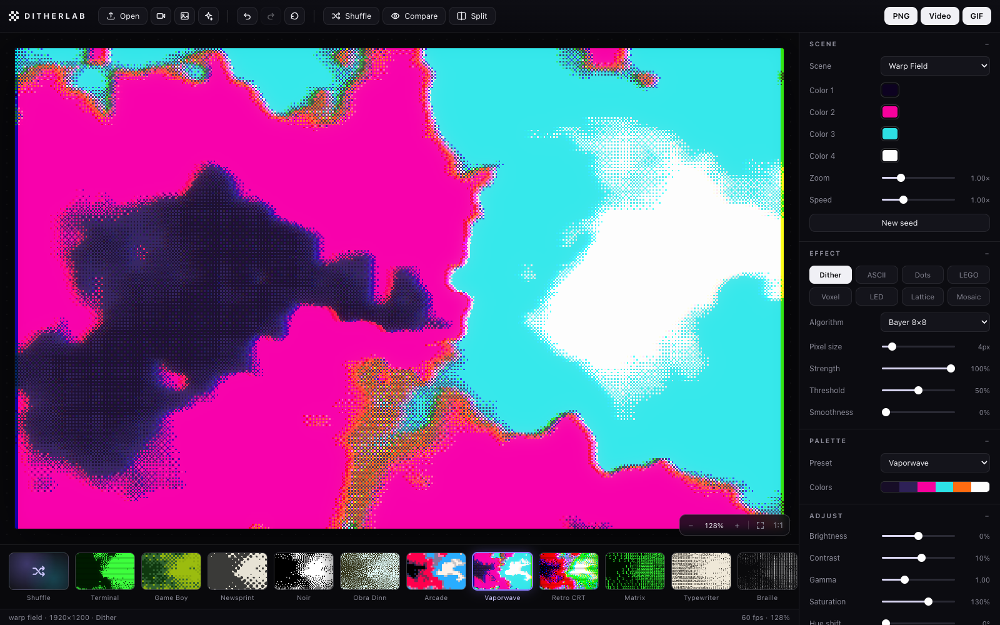
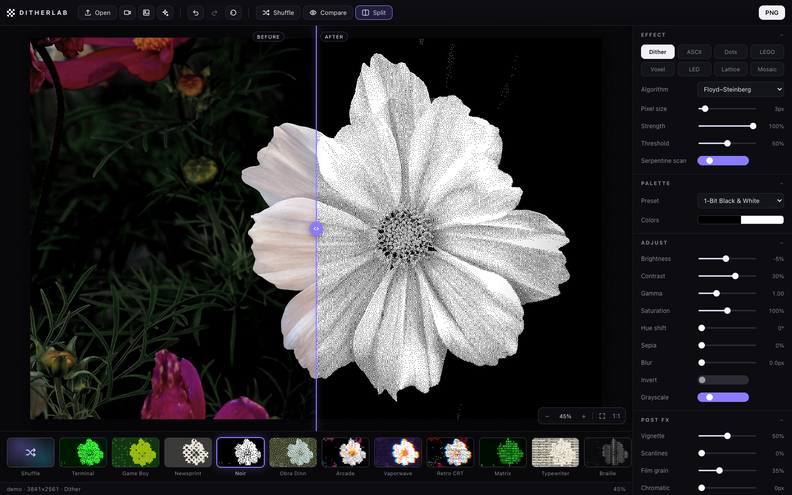
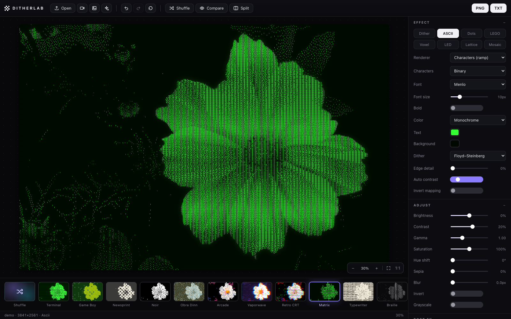
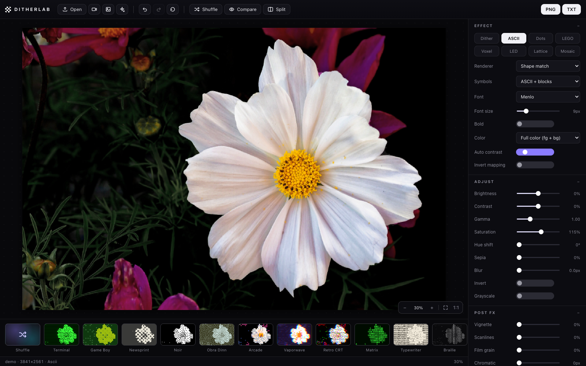
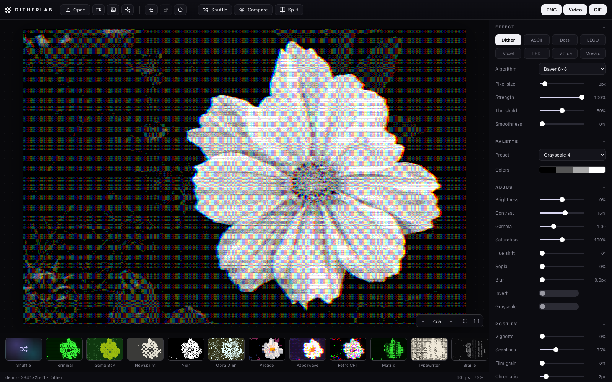
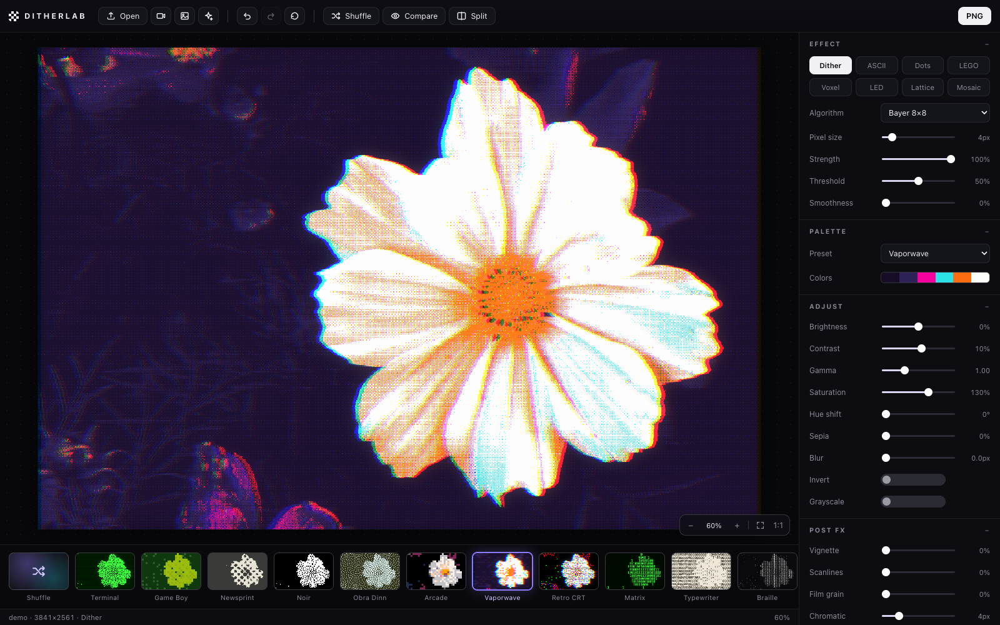
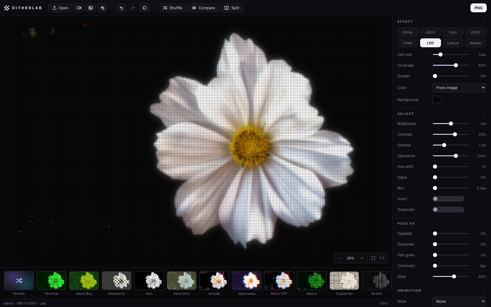

# Ditherlab

**A dither & ASCII art studio for images and video — right in your browser.**

Drop in a photo, a video, or your webcam feed and turn it into 1-bit dither art, Game Boy pixels, newsprint halftones, structural ASCII, braille dot art, LEGO bricks, isometric voxels, LED walls and more. Everything runs locally: no uploads, no accounts, no build step, zero dependencies.



*Everything renders in real time — here a Vaporwave dither with an animated light sweep:*



- [Quick start](#quick-start)
- [Effect modes](#effect-modes)
- [Generative scenes](#generative-scenes)
- [Dithering](#dithering)
- [ASCII art](#ascii-art)
- [Palettes](#palettes)
- [Adjustments, post FX & animation](#adjustments-post-fx--animation)
- [The editor](#the-editor)
- [Video & webcam](#video--webcam)
- [Exports](#exports)
- [macOS app](#macos-app)
- [Keyboard shortcuts](#keyboard-shortcuts)
- [How it works](#how-it-works)

## Quick start

```sh
git clone git@github.com:jjanousek/dither_app.git
cd dither_app
python3 scripts/serve.py        # or: npm start (plain `python3 -m http.server 8173` works too)
# open http://127.0.0.1:8173
```

A static server is needed only because ES modules require `http://`. The server binds to `127.0.0.1`, so nothing is reachable from your network. The app opens with a built-in demo scene — drop any image or video on it, paste from the clipboard, or hit the webcam button.

**Shareable links:** `?preset=<id>` boots straight into a preset, `?gen=<scene>` into a generative scene, `&split=1` opens the split view — e.g. `http://127.0.0.1:8173/?preset=gameboy&split=1`.

## Effect modes

Eight renderers, switchable with one click. All of them run on stills, videos, and the webcam, and all sit on top of the same adjustment / post-FX / animation stack.

| Mode | What it does |
| --- | --- |
| **Dither** | 19 dithering & quantization algorithms against 30 retro palettes |
| **ASCII** | four text renderers, from classic ramps to chafa-style structural matching |
| **Dots** | halftone-style dot grid, sized by brightness |
| **LEGO** | studded bricks with gradient shading |
| **Voxel** | isometric 3D columns — bright pixels rise |
| **LED** | glowing LED wall with bloom |
| **Lattice** | node-and-edge network graph |
| **Mosaic** | flat tiles with grout lines |

The cell modes (Dots → Mosaic) share controls for cell size, coverage, scatter jitter, and color: sample colors from the image or render as a duotone (background + foreground color).

## Generative scenes

No source material? Hit **Generate** (the sparkle button): six animated procedural scenes — **Mesh Gradient, Neuro Noise, Warp Field, Smoke, Voronoi Flow, Metaballs** — render straight into the pipeline like a live video source, so every dither/ASCII mode, palette, and post effect applies in real time. Each scene has its own palette, zoom, speed and seed controls, and every scene is a pure function of a loop phase, so **GIF exports are perfectly seamless loops**. Clicking Generate again cycles scenes; `?gen=<scene>` boots straight into one.



## Dithering

**Error diffusion** (CPU, with serpentine scan and strength control): Floyd–Steinberg, False Floyd–Steinberg, Atkinson, Jarvis–Judice–Ninke, Stucki, Burkes, Sierra, Two-Row Sierra, Sierra Lite.

**Ordered** (WebGL2 fragment shader, real-time at any size): Bayer 2×2 / 4×4 / 8×8, clustered-dot 4×4 / 8×8, and true blue noise generated at startup with the void-and-cluster method.

**Halftone** (procedural shader): rotating dot screen and line screen with adjustable cell scale and screen angle.

Plus white noise and plain nearest-color quantization. Pixel size (1–32) sets the working resolution; threshold biases light/dark; both CPU and GPU paths share identical adjustment math and the same perceptually-weighted nearest-palette quantizer, so switching algorithms never shifts colors.



## ASCII art

Four renderers, informed by the best converters in the field (chafa, libcaca, jp2a, drawille):

- **Characters (ramp)** — 14 character sets plus custom. Ramps are **coverage-calibrated**: each glyph is rasterized in your chosen font and sorted by measured ink, so tones map accurately. Optional cell-level Floyd–Steinberg or Bayer dithering removes banding in gradients, and an **edge detail** slider overlays Sobel edge-directed glyphs (`- / | \`) along contours.
- **Shape match** — structural matching, the chafa algorithm: every glyph is pre-rasterized to an 8×8 bitmap; each image cell is binarized against its own contrasting colors, prefiltered by Hamming distance, and the best candidates are refined by fitting per-glyph foreground/background colors and measuring true color error. Symbol pools: pure ASCII or ASCII + block/box-drawing characters.
- **Blocks 2×2** — quadrant mosaic: one of 16 block characters per cell plus two fitted colors (luminance-gap splitting) — image-like output at twice the character resolution.
- **Braille 2×4** — Unicode braille dot art with **Floyd–Steinberg dithered dots** (the difference between mush and beautiful gradients) and an adjustable dot threshold.

Shared options: font (Menlo / SF Mono / Monaco / Courier) + bold, font size 4–32 px, percentile auto-contrast, invert mapping, and three color modes — monochrome (any text/background colors), colored glyphs, or **full color** (foreground *and* background fitted per cell).



The shape-matching renderer in full color rebuilds the image out of pure text — every cell is a glyph chosen for its shape, with foreground and background colors fitted per cell:



## Palettes

30 presets: 1-bit black & white (and inverted), grayscale 4/8/16, Game Boy DMG / Pocket / Light, amber & green & blue terminal phosphors, E-Ink paper, Macintosh, CGA (both mode-4 palettes and full 16), EGA, Commodore 64, ZX Spectrum, NES, PICO-8, Apple II, Teletext, Vaporwave, Sepia, Sunset, Nokia 3310, Obra Dinn, CMYK, RGB primaries — plus a **custom palette editor** with up to 32 colors (right-click a swatch to remove it).

## Adjustments, post FX & animation

**Adjustments** (all modes): brightness, contrast, gamma, saturation, hue shift, sepia, blur, invert, grayscale.

**Post FX** (all modes): vignette, scanlines, film grain, chromatic aberration, glow.

**Animation** — six phase-driven styles that work in every mode, on videos *and still images*:

| Style | Effect |
| --- | --- |
| Breathe | slow exposure swell |
| Pulse | double-beat heartbeat |
| Sweep | light band traveling across the frame |
| Wave | sinusoidal row distortion |
| Flow | the dither pattern itself drifts (6 directions) |
| Shimmer | deterministic pattern jitter |

Speed and intensity are adjustable. Because animation is a pure function of a normalized phase, animated stills export as **seamlessly looping GIFs** (exactly one cycle is baked) or as fixed-length video recordings.



## The editor



- **Zoom & pan viewport** — scroll to zoom around the cursor, drag to pan, double-click to toggle fit ↔ actual pixels, with floating zoom controls and a live zoom readout.
- **Before/after split view** — a draggable divider with the untouched original on the left and the processed result on the right, live even during video playback. Hold-to-compare (`C`) flips the whole frame.
- **Live preset thumbnails** — 26 one-click looks (Terminal, Game Boy, Newsprint, Noir, Obra Dinn, Arcade, Vaporwave, Retro CRT, Matrix, Typewriter, Braille, Structural, Textmode Color, Block Mosaic, LEGO Brick, Voxel City, LED Wall, Constellation, Mosaic Tile, Amber Tube, Riso Print, Nokia LCD, Ink Dots, Signal Drift, Heartbeat, Tidal), each thumbnail rendered live from *your* media. Plus a Shuffle card that rolls a random look.
- **Undo/redo** — every settings change is snapshotted (`⌘Z` / `⇧⌘Z`, 100 steps).
- **Status bar** — file name, resolution, active mode, live fps, zoom level.
- Drag & drop anywhere, clipboard paste, and a demo scene so the app never opens empty.



## Video & webcam

The full pipeline runs per frame in real time: play/pause, scrubber, playback speed (0.25–2×), and a live fps readout. CPU-bound algorithms are capped at a working-resolution budget during playback so previews stay fluid. The webcam is a first-class source — every mode and export works on it.

## Exports

| Format | Notes |
| --- | --- |
| **PNG** | pixel-exact, source resolution, or 2× — post FX included |
| **Video** | WebM/MP4 via MediaRecorder; records the live preview in real time and carries the source's audio track (keep the tab visible while recording) |
| **GIF** | built-in GIF89a encoder: exact colors for palettized output, weighted median-cut global palette beyond 256 colors, drift-free frame timing; animated stills bake one seamless loop |
| **TXT / ANS / HTML** | ASCII output as plain text, ANSI truecolor (`cat file.ans` in any modern terminal), or a self-contained web page — or copy straight to the clipboard |

Animated stills add a record-length option (3/5/10 s) for video export.

## macOS app

```sh
scripts/build-app.sh
```

builds a **native** `Ditherlab.app` (Swift + WKWebView) into `~/Applications` — its own window and Dock icon, no browser involved. It starts the local server on launch, shuts it down when you quit (⌘Q or close the window), opens external links in your default browser, and saves exports straight to `~/Downloads`. Building needs the Xcode Command Line Tools (`xcode-select --install`); re-run the script if you move the project folder. The dithered app icon is generated by `scripts/make-icon.py` — with the same Bayer matrix the app uses.

## Keyboard shortcuts

| Key | Action |
| --- | --- |
| `Space` | Play / pause video |
| `C` (hold) | Compare with original |
| `S` | Toggle split view |
| `⌘Z` / `⇧⌘Z` | Undo / redo |
| `+` / `−` | Zoom in / out |
| `0` / `1` | Fit to view / actual pixels |

## How it works

Vanilla ES modules, Canvas 2D and WebGL2 — no framework, no bundler, no npm packages.

```
index.html, css/style.css      single-page shell, dark editor theme
js/main.js                     state → render loop → present
js/view.js                     viewport (zoom / pan / split divider)
js/state.js, js/presets.js     parameter schema, looks, shuffle
js/ui.js                       control panel builder
js/sources.js                  image / video / webcam / drop / paste + demo scene
js/engine/engine.js            pipeline router (GPU | CPU | ASCII | cells)
js/engine/shaders.js, gl.js    WebGL2 uber-shader: ordered/noise/halftone + palette map
js/engine/cpu.js               adjustment LUTs, error diffusion, ordered fallback
js/engine/bluenoise.js         void-and-cluster blue-noise generator
js/engine/ascii.js             ASCII engine (ramps, shape matching, quadrants, braille)
js/effects/cells.js            Dots / LEGO / Voxel / LED / Lattice / Mosaic
js/effects/postfx.js           canvas-compositing post effects
js/export/exporters.js         PNG / video / GIF / TXT / ANSI / HTML drivers
js/export/gif.js               GIF89a + LZW encoder
scripts/                       macOS app (Swift + WKWebView) and icon generator
```

Design notes:

- Pointwise dithers (ordered, noise, halftone) run in a single WebGL2 fragment shader; error diffusion is inherently sequential, so it runs on the CPU at the downsampled working resolution. Both paths share identical adjustment math and the same nearest-palette quantizer.
- The source frame is downsampled per renderer: one sample per pixel for dithering, one per character cell for ramp ASCII, 8×8 per cell for shape matching, 2×2 for quadrants, 2×4 for braille.
- Glyph atlases are rasterized once per font and cached: 8×8 coverage bitmaps (as two 32-bit words for fast XOR+popcount Hamming distance) double as the ink-coverage measurements that calibrate the character ramps.
- The GIF encoder keeps exact colors for palettized output and falls back to a weighted median-cut global palette when a clip exceeds 256 colors; frame delays use cumulative rounding so long GIFs don't drift.
- Animation is a pure function of a normalized phase, which is how animated stills can be baked into GIFs that loop without a seam.
- Video export records the live preview canvas in real time; GIF export re-renders deterministically frame by frame.

## Acknowledgements

Inspired by the excellent [ditther.com](https://www.ditther.com/) and [ascii-magic.com](https://www.ascii-magic.com/); the generative scenes are original implementations inspired by the techniques in [Paper Shaders](https://github.com/paper-design/shaders) (Apache-2.0, by the [paper.design](https://paper.design/) team) — this is an independent, from-scratch implementation of the genre they popularized. The ASCII engine owes its techniques to the published work around [chafa](https://hpjansson.org/chafa/), [libcaca](http://caca.zoy.org/wiki/libcaca), jp2a, and the braille-art community. All classic dithering algorithms are due to their original authors (Floyd & Steinberg, Bill Atkinson, Bayer, Ulichney, et al.).
